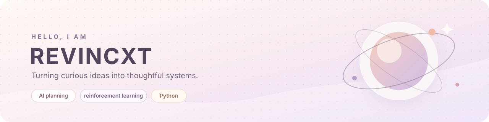
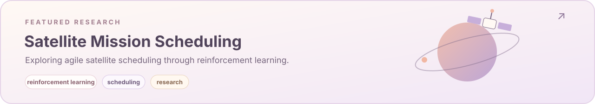
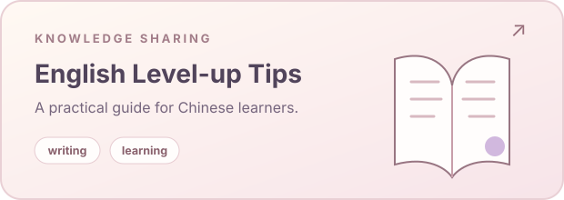

 

[**Selected work**](#selected-work) &nbsp;·&nbsp; [**Current focus**](#current-focus) &nbsp;·&nbsp; [**All repositories**](https://github.com/Revincxt?tab=repositories)

## A little about me

我喜欢研究智能系统如何理解目标、制定计划并解决现实问题，也喜欢将复杂的知识整理成清晰、实用的内容。

My work sits at the intersection of **automated planning**, **reinforcement learning**, and small tools built from curiosity.

## Selected work

 

<table>
  <tr>
    <td width="50%" valign="top">
      
    </td>
    <td width="50%" valign="top">
      
    </td>
  </tr>
</table>

## Current focus

`AI planning` &nbsp; `reinforcement learning` &nbsp; `Python` &nbsp; `technical writing`

- Exploring how learning and planning methods can work together.
- Turning research ideas into small, understandable experiments.
- Sharing notes that make difficult subjects easier to approach.

 

Made with curiosity, clarity, and a soft spot for thoughtful systems.

